

# 🏍️ OpenCfMoto

### Wireless Android Auto on your CFMoto MotoPlay dashboard — no root, no PC.

Put **Google Maps / Waze** on your bike's dash over Wi-Fi, drive it from the touchscreen, and log
every ride — all from an Android phone in your pocket.

 

**💬 Questions, logs, or a new bike to add? [Join the Open CFMoto Discord](https://discord.gg/xRt5yZy2U).**

 

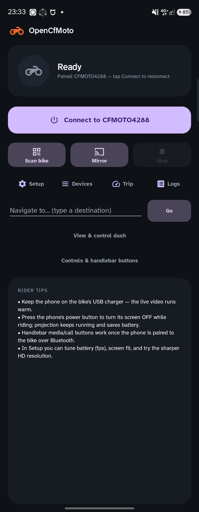&nbsp;
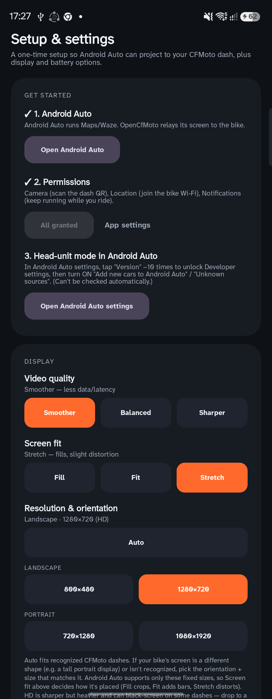&nbsp;
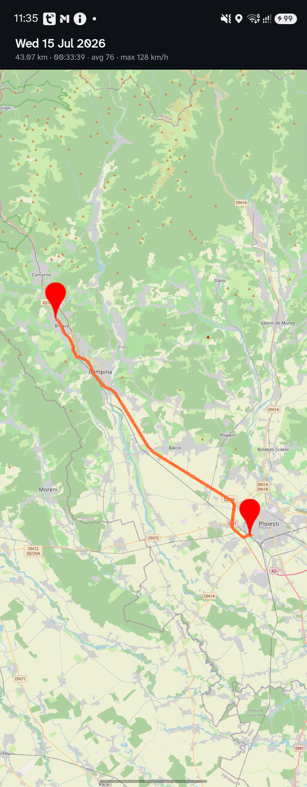

  

### 🎥 Live demo — Android Auto on a CFMoto dash

**▶ [Watch the full demo](docs/media/hud-demo.mp4)** — Google Maps navigation + media, driven from the
dash touchscreen.

---

> ⚠️ **Community project — not affiliated with or endorsed by CFMoto.** Developed and tested against
> CFMoto **800MT** and **1000 MT‑X** dashes, with community support for **CFDL16-class** dashes
> (450SR, 675SR, 300SR, 450NK, 675NK, 450MT, 450CL‑C). Other bikes/phones may need a retry or aren't
> supported yet. Don't rely on it for critical navigation — set your route **before** you ride. Use at
> your own risk.

---

## ✨ Features

| | |
| --- | --- |
| 🗺️ **Android Auto on the dash** | Relays Google Maps / Waze / any AA app to the MotoPlay screen over Wi‑Fi. |
| 👆 **Multi-touch** | Two-finger pinch-to-zoom and full tap/scroll straight from the dash touchscreen. |
| 📺 **In-app Dash view** | Watch and drive the live dash from inside the app — touch, on-screen pad, and a fullscreen mode — handy for setting up nav before you ride. |
| 🎛️ **Handlebar buttons drive AA** | On touchless dashes, the bike's ▲/▼/enter buttons navigate Android Auto over Bluetooth (rotary knob / select / back / home) — every gesture remappable. |
| 🕹️ **On-screen pad + Navigate-to** | In-app D-pad + rotary knob and a "Navigate to…" box push a route to the dash without touching it; map a handlebar button to a saved place for one-press turn-by-turn. |
| 🎙️ **Voice / Assistant** | Streams your (helmet) mic to Android Auto so "Hey Google" sets a destination hands-free. |
| ⚡ **One-tap Connect & Auto-connect** | Remembers your bike; reconnects on launch automatically when it's in range (toggleable). |
| 🛰️ **Trip computer + ride logging** | Live speed/distance/duration from GPS, auto-logs every ride, with a saved-trips list and route maps. |
| 📐 **Smart resolution & orientation** | Auto-fits recognized dashes and learns unknown ones; manual landscape/portrait + SD/HD overrides. |
| 🔋 **Battery & power tuning** | Frame-rate caps (Smooth / Balanced / Saver) to reduce heat and drain during long rides. |
| 🛟 **Auto-recovery watchdog** | Detects a stalled or dropped dash and reconnects automatically — no Stop/Start. |
| 🔄 **Seamless resume** | Stop the bike for a bit? Projection parks to save battery, watches for the bike, and re-projects on its own when it's back — screen off, phone stowed. |
| 📱 **Whole-screen mirroring** | Optional: mirror your entire phone to the dash instead of Android Auto. |
| 🧰 **In-app diagnostics** | Live log panel with one-tap share for troubleshooting. |

---

## 📋 What you need

- **A CFMoto motorcycle with a MotoPlay / EasyConnect dash.**
  Confirmed working: **800MT** (CFDL26) and **1000 MT‑X**. Community-supported **CFDL16-class** dashes
  (450SR, 675SR, 300SR, 450NK, 675NK, 450MT, 450CL‑C) — these are typically **non‑touch**, so you
  drive Android Auto with the **handlebar buttons** and the in-app pad (see
  [Handlebar & on-screen controls](#-handlebar--on-screen-controls)). Other models may work partially —
  the app learns unrecognized dashes after the first connect (see
  [Resolution & orientation](#-resolution--orientation)).
- **An Android phone**, Android **10 or newer**.
- **Google Android Auto** installed and set up once (see [step 3](#3-one-time-android-auto-setup)). AA
  is what runs Maps/Waze — OpenCfMoto relays its screen to the bike.
- **The OpenCfMoto app** (`app-debug.apk`) — sideloaded (see [step 2](#2-install-the-app)).
- A **mobile-data plan** is recommended: the phone joins the bike's Wi‑Fi for the dash link, so live
  maps/traffic come over cellular.

No root, no VPN, no PC required to ride.

---

## 🏍️ Supported bikes

OpenCfMoto speaks the **CFMoto MotoPlay** protocol — the same phone-projection system the official
**CFMOTO RIDE** app uses. Any bike with a MotoPlay-capable dash is a candidate: generally **2024+**
models fitted with a **T‑BOX**. Some need a one-time **dash OTA update** (triggered from the CFMOTO
RIDE app) before MotoPlay appears.

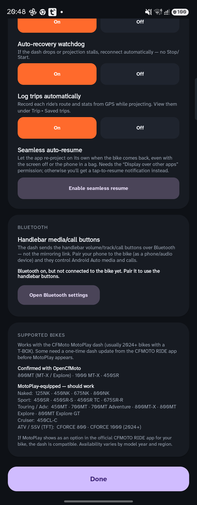

**✅ Confirmed working with OpenCfMoto**

- **800MT** (MT‑X / Explore) — landscape touchscreen (CFDL26)
- **1000 MT‑X** — portrait touchscreen (CFDL26)
- **450SR** — non‑touch dash (CFDL16); driven with the handlebar buttons + on-screen pad

**🧪 MotoPlay-equipped — should work (untested; reports welcome)**

| Family | Models |
| --- | --- |
| **Naked (NK)** | 125NK · 450NK · 675NK · 800NK (Advanced / Sport) |
| **Sport (SR)** | 450SR (2024+) · 450SR‑S · 450SR TC · 675SR‑R |
| **Touring / Adventure (MT)** | 450MT · 700MT · 700MT Adventure · 800MT‑X · 800MT Explore · 800MT Explore GT |
| **Cruiser (CL)** | 450CL‑C |
| **ATV / SSV (TFT dash)** | CFORCE 800 (2024+) · CFORCE 1000 (2024+) |

**🚫 Not MotoPlay-equipped** (per CFMoto): 800MT Sport, 800MT Touring, 450SR World Champion Edition,
700CL‑X (Adventure / Heritage / Sport).

> **Availability varies by model year and region.** Quickest check: if **MotoPlay** shows up as a
> subscription option in the official **CFMOTO RIDE** app for your bike, the dash speaks the protocol
> OpenCfMoto uses. **Touch** dashes are driven with the screen; **non‑touch** dashes with the
> handlebar buttons + on-screen pad. Tried a bike that isn't listed as confirmed?
> Tell us in **[Discord](https://discord.gg/xRt5yZy2U)** so we can add it.

Sources: CFMoto RIDE app model availability tables ([CFMOTO Benelux](https://cfmotobenelux.com/en/cfmoto-ride-app/),
[CFMOTO Canada](https://cfmoto.ca/en/cfmoto-ride-app)) and the CFMoto RIDE / MotoPlay OTA rollout notes.

---

## 🚀 Getting started

### 1. Prepare the bike

While parked, open the **MotoPlay / phone-connection (EasyConnect) screen** on the dash so it shows
its **pairing QR code** — the same QR the official CFMoto app uses.

### 2. Install the app

The app isn't on the Play Store — you sideload the APK.

1. Download the latest **`OpenCfMoto.apk`** from the
   **[Releases page](https://github.com/zanderp/open-cfmoto/releases/latest)**
   (direct link: <https://github.com/zanderp/open-cfmoto/releases/latest/download/OpenCfMoto.apk>).
2. Tap it in a file manager / your browser downloads to install; allow installation from your
   browser/file manager when Android prompts about "unknown sources".
3. Open **OpenCfMoto** once and grant the permissions it requests:
   - **Location** — required by Android to join the bike's Wi‑Fi (the app doesn't track you) and to
     log trips.
   - **Camera** — to scan the bike's pairing QR code.
   - **Notifications** — so it can keep running in the background while you ride.

> 💡 The **Setup** screen has an *All granted* button that checks every permission at once and
> deep-links to system settings for anything missing.

### 3. One-time Android Auto setup

Android Auto must be installed and allowed to start in "self / head-unit" mode.

1. Install **Android Auto** from the Play Store (often pre-installed) and open it once to accept its
   terms.
2. In Setup, tap **Open Android Auto settings**, scroll to the bottom and tap **Version** about **10
   times** to unlock Developer settings.
3. In the **⋮ Developer settings** menu, turn **on** *"Add new cars to Android Auto"* / *"Unknown
   sources"* (wording varies by version).

You only do this once.

### 4. Connect and ride

1. In OpenCfMoto tap **Scan bike** and point the camera at the dash's QR code. The app reads your bike
   model + Wi‑Fi and remembers it.
2. Android Auto starts in the background and the phone pops a **Wi‑Fi dialog** to join the bike's
   hotspot (e.g. *CFMOTO4288*) — tap **Connect / Allow**.
3. The dash connects and **Android Auto appears on the dashboard**. 🎉

From then on, drive Android Auto **from the dash touchscreen** — tap, scroll, and pinch-to-zoom.
Your phone can be locked or in your pocket; a persistent notification keeps the link alive.

**Next time**, just tap **Connect to `<your bike>`** — or leave **Auto-connect** on and it links up on
launch whenever the bike's Wi‑Fi is in range.

**To stop:** tap **Stop** in the app. Closing or killing the app also ends projection cleanly.

---

## 🧭 Feature guide

### 🛰️ Trip computer & ride logging

The **Trip** screen is a GPS-driven ride computer showing live speed, distance, duration, and
max/avg speed. Speed/distance come from the phone's GPS (the bike doesn't share telemetry over the
mirroring link).

- **Automatic logging** — with *Log trips automatically* enabled, every projection session records a
  ride in the background, auto-segmenting when you stop for a while.
- **Saved trips** — tap **Saved trips** to browse past rides with their stats; tap one to see its
  **route on a map** (OpenStreetMap), or long-press to delete.
- Manual **Start / Pause / Reset** controls are there too.

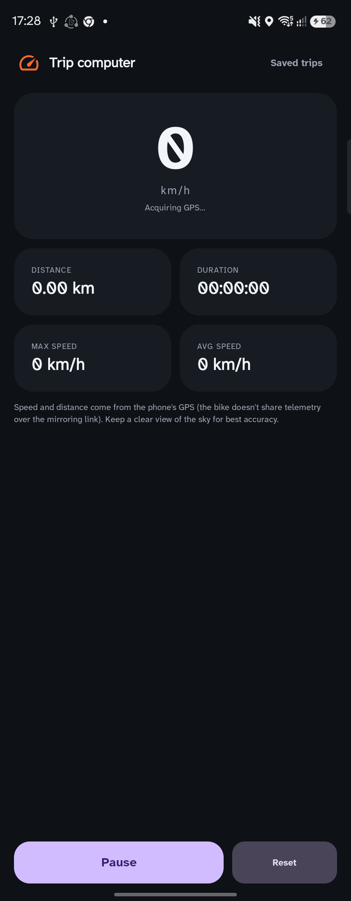&nbsp;
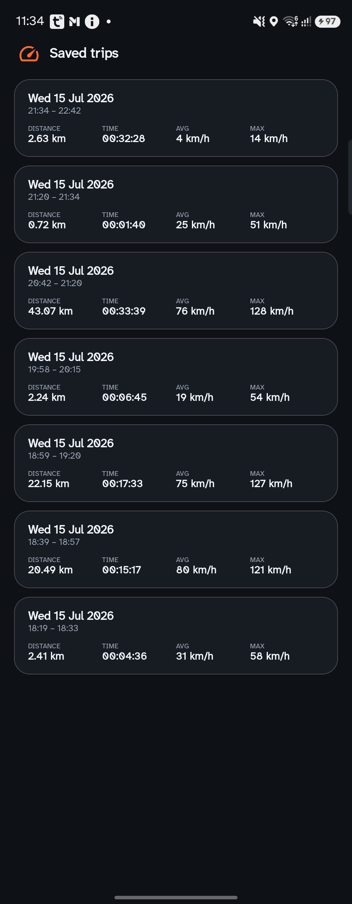&nbsp;

 

### 📱 Multiple bikes

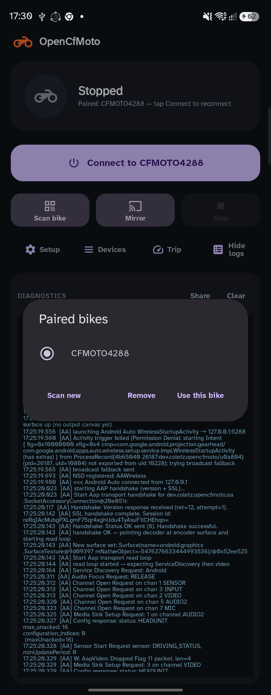

**Devices** lists every bike you've paired. Pick one and tap **Use this bike**, **Scan new** to add
another, or **Remove** to forget one. The most recent bike is what one-tap **Connect** and
auto-connect target.

 

### 📐 Resolution & orientation

Android Auto only supports a fixed set of resolutions, and dashes come in different shapes. In
**Setup ▸ Resolution & orientation**:

- **Auto** fits recognized dashes automatically. For an **unrecognized** dash, the app reads the
  screen geometry the dash reports on connect and **remembers it** — so on the next connect it picks
  the right **orientation (landscape/portrait)** by itself. (You may see a one-time letterboxed
  frame the very first time; reconnect once and it self-corrects.)
- Manual overrides: **Landscape 800×480 / 1280×720 (HD)** and **Portrait 720×1280 / 1080×1920 (HD)**.
- **Screen fit** — *Fill* (crop), *Fit* (letterbox), or *Stretch* (fill with slight distortion).

> HD is sharper but heavier and can black-screen on some dashes — drop to a smaller size or Auto if
> that happens.

### 🔋 Battery & power, startup & recovery

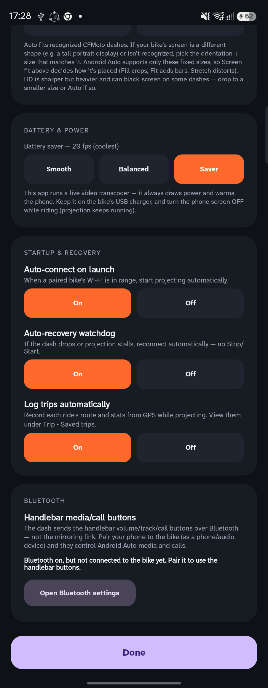

This app runs a live video transcoder, so it always draws power and warms the phone. To manage that:

- **Battery & power** — cap the frame rate: *Smooth* / *Balanced* / *Saver* (coolest). Keep the phone
  on the bike's USB charger and turn its screen **off** while riding (projection keeps running).
- **Auto-connect on launch** — start projecting automatically when a paired bike's Wi‑Fi is in range.
- **Auto-recovery watchdog** — if the dash drops or the stream stalls, reconnect automatically.
- **Seamless resume** — see below.
- **Log trips automatically** — record every ride's route + stats while projecting.

 

### 🔄 Seamless resume (stop-and-go rides)

Stopped for fuel, a coffee, or a quick photo? When the bike's Wi‑Fi drops, the app keeps Android Auto
alive for a ~1 minute grace window (so brief blips resume instantly). If the bike stays off longer, it
**parks** the projection — tearing down the video transcode so the phone stops heating and draining —
and quietly watches for the bike's Wi‑Fi to come back. When it does, it **re-projects Android Auto and
maps automatically**. It keeps watching until you tap **Stop**, and it's gated behind the *Auto-recovery*
setting.

**For fully hands-free resume with the phone in a bag or the screen off**, enable one extra permission:

> **Setup ▸ Startup & recovery ▸ Seamless auto-resume ▸ “Enable seamless resume”** → turn on
> **Display over other apps** for OpenCfMoto.

Android blocks apps from relaunching Android Auto from the background unless they hold this permission.
- **Granted:** the app resumes projection entirely on its own — no touch needed, even locked/stowed.
- **Not granted:** everything still works, but resume ends with a **“Bike reconnected — tap to resume”**
  notification; one tap re-projects.

The permission is optional and off by default. Recommended if you keep your phone pocketed or in a
backpack while riding.

 

### 🎛️ Handlebar & on-screen controls

Touchscreen dashes (800MT, 1000 MT‑X) are driven by touch. **Non-touch dashes** (the CFDL16-class
bikes — 450SR, 675SR, 300SR, 450NK, 675NK, 450MT, 450CL‑C) are driven by the **handlebar buttons**
and an **on-screen pad** instead. Open **Controls & handlebar buttons** from the main screen.

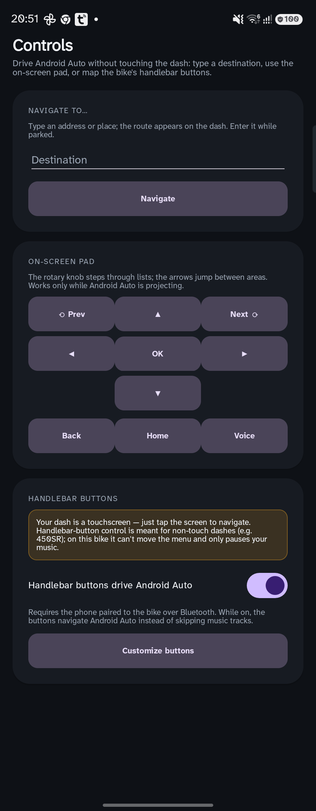&nbsp;
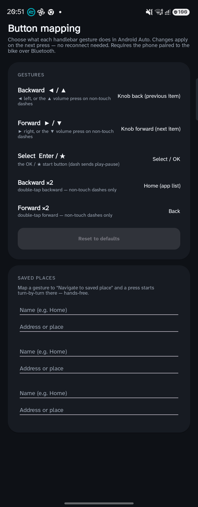

 

**Handlebar buttons → Android Auto.** The buttons reach the phone over **Bluetooth** (AVRCP) — *not*
the mirroring link — so you must **pair the phone to the bike over Bluetooth** first. Turn on
*Handlebar buttons drive Android Auto* and the defaults are:

| Gesture (button) | Default action |
| --- | --- |
| **Backward** — ◀ left, or ▲ volume on non-touch dashes | Rotary knob back (previous item) |
| **Forward** — ▶ right, or ▼ volume on non-touch dashes | Rotary knob forward (next item) |
| **Select** — Enter / ★ (start) button | Select / OK |
| **Backward ×2** (double-tap, non-touch dashes) | Home (app list) |
| **Forward ×2** (double-tap, non-touch dashes) | Back |

The mapping is by **meaning, not by physical button**: the app auto-routes whatever your bike
sends — the 450SR's ▲/▼ volume, or the 800MT's ◀/▶ track keys — into the same Backward / Forward /
Select gestures, so one setup works across bikes.

Every gesture is **remappable** in **Customize buttons** (knob, D-pad, select, back, home, Assistant,
do-nothing, or *navigate to a saved place*). While the mode is on, the buttons stop skipping music
tracks (Android gives the media buttons to one app at a time) — toggle it off for normal media
control.

**On-screen pad + Navigate to…** The Controls screen also has an on-screen D-pad, rotary knob, and a
**"Navigate to…"** box: type an address and turn-by-turn appears on the dash, no dash interaction
needed. Save up to three places and map them to a handlebar button for **one-press** navigation with
the phone in your pocket (that background launch needs *Display over other apps* — the app prompts you
when a nav button is mapped).

**Voice.** Map any gesture (or tap **Voice**) to the Assistant and ask for directions through your
helmet mic — OpenCfMoto streams the mic to Android Auto (grant the microphone permission when asked).

### 📺 Dash view (watch & control from the phone)

Tap **View & control dash** on the main screen to see the **live dashboard inside the app**. It mirrors
exactly what's on the bike, so you can set up navigation or pick music on the phone before you ride —
then pocket it. On touch dashes you can **drive it directly with your fingers** (pinch-to-zoom
included); a bottom bar (knob, D-pad, OK, Back, Home, voice) works on every dash. Hit **⛶** for a clean
fullscreen view (hides the app and phone bars); **Back** exits fullscreen.

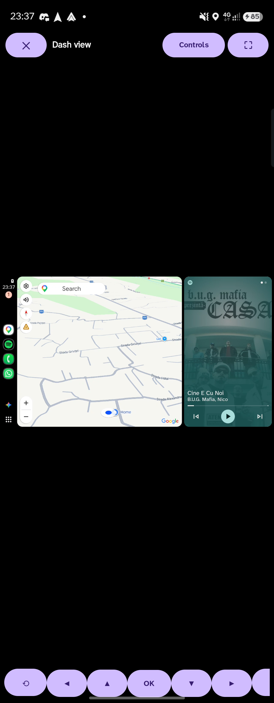

 

### 🧰 Diagnostics

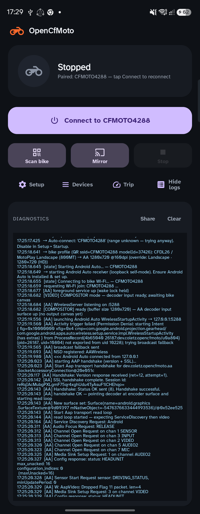

Tap **Logs** to expand a live diagnostics panel. It narrates every step of the connection and is the
best way to understand what's happening. Use **Share** to export the log if you need help, or
**Clear** to reset it.

 

---

## 🔘 Button reference

| Button | What it does |
| --- | --- |
| **Connect to `<bike>`** | One-tap reconnect to your last paired bike and project Android Auto. |
| **Scan bike** | Scan a bike's pairing QR to pair/connect (adds it to Devices). |
| **Mirror** | Mirror your **whole phone screen** to the dash instead of Android Auto. |
| **Stop** | Stop everything and disconnect from the bike Wi‑Fi. |
| **Setup** | Permissions, Android Auto setup, display/battery, startup & recovery, Bluetooth. |
| **Devices** | Manage paired bikes (select / add / remove). |
| **Trip** | GPS trip computer + saved rides and route maps. |
| **Controls & handlebar buttons** | On-screen D-pad/knob, "Navigate to…", and handlebar-button setup + remapping. |
| **Logs** | Show/hide the live diagnostics panel (with Share / Clear). |

---

## 🩺 Troubleshooting

**Normal behavior**
- A brief black/blank moment on the dash while it connects, then the map appears.
- Opening **All Apps** on the dash or **taking a call** may freeze the dash for a couple of seconds,
  then resume.
- Navigation **voice prompts** come out of your phone / paired helmet headset, not the bike speakers.

**If something's wrong**

| Symptom | Try this |
| --- | --- |
| App **won't connect** / keeps retrying, or the dash shows **"device is not on the network"** | This is usually the **dash's Wi‑Fi hotspot** stuck in a bad state. On the dash's phone-connection screen, **toggle between the Android and iOS (CarPlay) QR codes** — this restarts the HUD's Wi‑Fi network — then tap **Connect** again. |
| Dash stays **black** after connecting | Tap **Stop**, then **Connect** / **Scan bike** again. Make sure the dash is on its phone-connection screen. |
| **No Wi‑Fi dialog** appears | Confirm the Location permission is granted; move the phone next to the bike; tap **Stop** and retry. Some phones show the dialog behind Android Auto — swipe back to OpenCfMoto. |
| **Android Auto never starts** | Re-check [step 3](#3-one-time-android-auto-setup) (developer mode + unknown sources). |
| **Auto-connect doesn't fire** | Ensure *Auto-connect* is On, the bike is paired, and its Wi‑Fi is in range; open the app or return to it to retry. |
| Picture is **stretched / letterboxed** on an unknown bike | Reconnect once so it learns the dash shape, or set the orientation/size manually in Setup. |
| Dash **froze** and didn't recover | With *Auto-recovery* on it should reconnect itself; otherwise tap **Stop** then **Connect**. |
| **Didn't resume on its own** after a long stop | Enable **Seamless resume** (Setup ▸ Startup & recovery → *Display over other apps*) so the app can re-project with the screen off; otherwise tap the **“Bike reconnected”** notification. |

**Getting help:** reproduce the issue, then tap **Logs ▸ Share** and send the log file — it describes
each step and makes problems diagnosable. Drop it in the
**[Discord](https://discord.gg/xRt5yZy2U)** and we'll help you out.

---

## 💬 Community

Got a question, a log to share, or a bike you'd like supported? **Join the
[Open CFMoto Discord](https://discord.gg/xRt5yZy2U).** It's the fastest place to get help, compare
notes across bikes/phones, share captures that help add new dash profiles, and hear about new releases.

---

## 📝 Good to know / limitations

- **Set your destination before riding.** Enter navigation while parked.
- Works over the bike's **Wi‑Fi** — keep the phone reasonably close to the dash.
- The live transcode **warms the phone and uses power** — charge it and turn the screen off while
  riding.
- On unsupported bikes or in poor Wi‑Fi you may hit the occasional hiccup and need a **Stop → Connect**.

---

## 🛠️ Building from source

Most riders can just install the release APK. To build it yourself:

1. Install **Android Studio** (bundles the JDK + Android SDK).
2. Create `local.properties` in the repo root pointing at your SDK, e.g.
   `sdk.dir=C:\\Users\\<you>\\AppData\\Local\\Android\\Sdk` (Windows) or
   `sdk.dir=/Users/<you>/Library/Android/sdk` (macOS). This file is git-ignored.
3. Build the debug APK:
   - Android Studio: open the project and **Run**, or
   - CLI: `./gradlew assembleDebug` (Windows: `gradlew.bat assembleDebug`). The APK lands in
     `app/build/outputs/apk/debug/`.

Requires JDK 11+ (Android Studio's bundled JBR works). The build uses the Gradle configuration cache
for fast incremental rebuilds.

---

## 🙏 Acknowledgements

This project stands on the shoulders of the people who reverse-engineered the CFMoto MotoPlay link
and built the Android Auto plumbing before us. Huge thanks to:

- **[dcoletto/open-cfmoto](https://github.com/dcoletto/open-cfmoto)** — the original CFMoto EasyConnect
  mirroring app this is based on.
- **[richardbizik/open-cfmoto](https://github.com/richardbizik/open-cfmoto)** — for the 1000 MT‑X
  support and profile work.
- **[BojanJ/open-cfmoto](https://github.com/BojanJ/open-cfmoto)** — for the more complete Android Auto
  integration we built on top of.
- **[ionutradu252/open-cfmoto](https://github.com/ionutradu252/open-cfmoto)** — for the CFDL16 / 450SR
  work this project's handlebar-button control, on-screen D-pad/knob, navigate-to, and Assistant mic
  were ported from.
- **[headunit-revived](https://github.com/andreknieriem/headunit-revived)** by *andreknieriem* — the
  Android Auto (AAP) receiver foundation.

Thank you to everyone in the CFMoto/EasyConnect community who shared logs, captures, and findings that
made this possible. See the [`docs/`](docs/) folder for the technical/architecture write-ups.

---

## 📜 License

OpenCfMoto is licensed under the **[GNU Affero General Public License v3.0](LICENSE)** (AGPL-3.0-or-later).
Copyright © 2026 **Alexandru** ([alexandru.rocks](https://alexandru.rocks)) and the OpenCfMoto
contributors. See [`NOTICE`](NOTICE) for the full copyright and attribution breakdown.

**What that means:** you're free to use, study, modify, and share the app. But if you distribute it —
or run a modified version as a network-accessible service — you **must** release your complete
corresponding source under the AGPL-3.0 and keep the copyright/attribution notices intact. **Nobody
can take OpenCfMoto closed-source or ship a proprietary product built on it.**

> **Why AGPL:** the Android Auto receiver (`dev.zanderp.opencfmoto/aa/`) is derived from the AGPLv3
> project [headunit-revived](https://github.com/andreknieriem/headunit-revived), so the combined work
> is AGPL-3.0 by inheritance. This is the strongest copyleft available and is a deliberate choice to
> keep the project — and every fork of it — open.

### 💼 Commercial licensing

Want to use the *original* OpenCfMoto code under terms other than the AGPL (for example, in a closed
product)? Those contributions are owned by the copyright holder and can be **separately licensed** —
reach out via [alexandru.rocks](https://alexandru.rocks) to discuss. Note that any AGPLv3 upstream
components (e.g. headunit-revived) would still need to be relicensed by their authors or replaced.

### 🤝 Contributing

Contributions are welcome under the AGPL-3.0. By submitting a pull request you certify the
[Developer Certificate of Origin](https://developercertificate.org/) (sign commits with `git commit -s`),
agree that your contribution is licensed under the AGPL-3.0, and grant the project maintainer the right
to also offer your contribution under a separate commercial license. This keeps dual-licensing possible
without every contributor holding a veto.

## 🔒 Privacy

OpenCfMoto is **local-first**: no account, no analytics, no project-run servers. Bike profiles, trip
logs, and diagnostics stay on your phone. The full permissions-and-privacy breakdown — including the
opt-in GPS trip logging and the OpenStreetMap map tiles — is in **[PRIVACY.md](PRIVACY.md)**.

Built with ❤️ for the CFMoto community — [join us on Discord](https://discord.gg/xRt5yZy2U).

